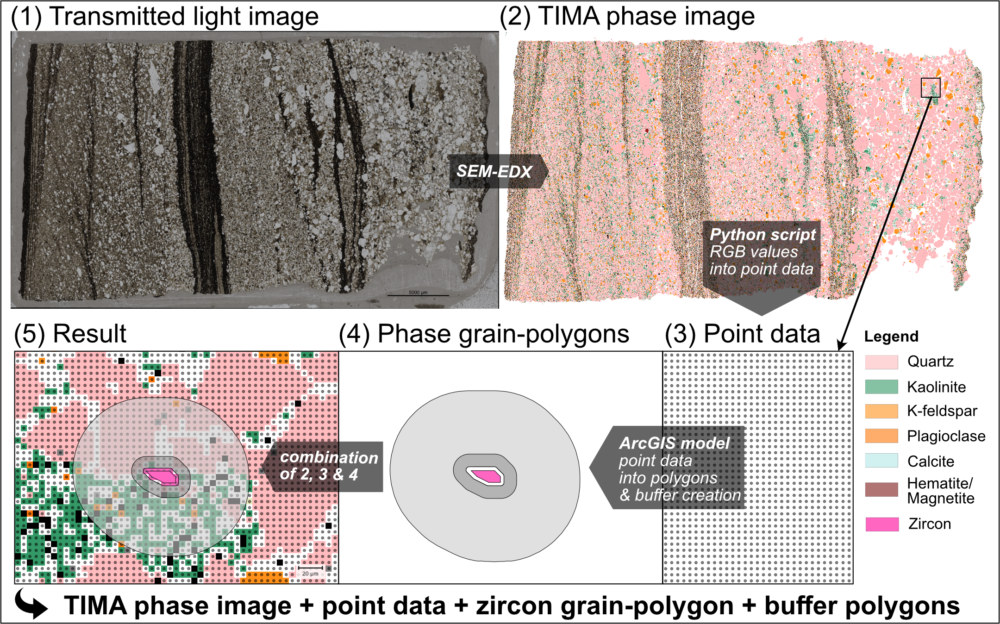
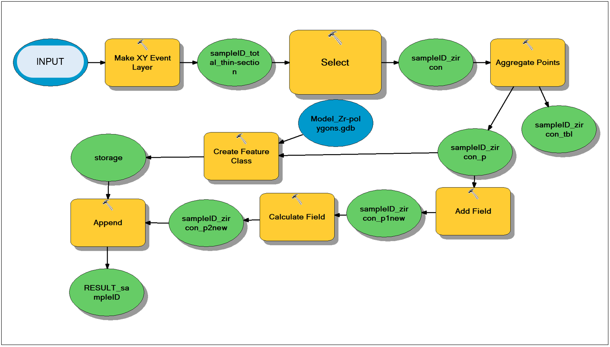

Supplementary Information for
# Thin-section detrital zircon geochronology mitigates bias in provenance investigations
Isabel C. Zutterkirch1, Christopher L. Kirkland1, Milo Barham1, Chris Elders2

1Timescales of Mineral Systems Group, School of Earth and Planetary Sciences, Curtin University, GPO Box U1987, Perth, WA 6845, Australia\
2School of Earth and Planetary Sciences, Curtin University, GPO Box U1987, Perth, WA 6845, Australia

Corresponding author: Isabel Zutterkirch. Building 312, School of Earth and Planetary Science, Curtin University, Perth, Western Australia
Email: i.zutterkirch@postgrad.curtin.edu.au

## This document includes
Supplementary text on grain size and buffer analysis of thin-sections and grain size analysis of hand-picked zircon mounts.

 [A. Thin-section analysis workflow](#A)\
Supplementary Figure A1: sample characterisation via automated mineralogy.\
Supplementary Figure A2: ArcGis model of zircon polygons.

 [B.	Grain size analysis of hand-picked zircon mounts](#B)

## A. Thin section analysis workflow
The following text describes the thin-section (Fig. A1 part 1) analysis workflow that commences with the production of a TIMA image (Fig. A1 part 2) and the identification of the mineral content pixel wise (Fig. A1 part 3). The pixels are coded for mineral phase (script ‘ImageRGB-Mineral-correlation.txt’) and the zircon points used to develop a zircon polygon (Fig. A1 part 4) following an ArcGIS model (script ‘ArcGis-Zr-polygon-model.txt’). Following the production of the zircon model and in order to analyse the zircon proximal phase content, a buffer analysis was conducted in ArcGIS by using the buffer analysis tool. To produce an overlay of buffers on the phase model the python script ‘Thin-section_Zr-buffer-analysis.txt’ is run (Fig A1 part 5).

Workflow:
-	Light microscope imaging
-	TIMA imaging
-	Mineral content transferred into point data; Script ‘ImageRGB-Mineral-correlation.txt’
-	Model zircon polygons; Script ‘ArcGis-Zr-polygon-model.txt’ (Fig. A2).
-	Buffer generation: Generate buffer polygons in ArcGis by using the ‘buffer analysis tool’. This tool creates buffer polygons around input features to a specific distance. In this study, the input features are the modelled zircon polygons.
-	Determine the mineral content within the buffers; Script ‘Thin-section_Zr-buffer-analysis.txt’

**Figure A1:** Process of sample characterisation via automated mineralogy. (1) Reflect light thin-section image. A Python script creates a point grid (3) from the TIMA phase image (2), which is aggregated to phase grain-polygons (4) based on an ArcGIS model. At this stage measured data can be georeferenced to the mineral polygons and their measured grain sizes compared to the overall grain sizes within the thin-section or further buffer analyses can define the lithology around dated zircons.

**Figure A2:** The illustrated ArcGis model creates zircon polygons based on TIMA phase images.

## B.	Grain size analysis of hand picked zircon mounts

Workflow:
- Acquire all grain contour vertices (x-y-coordinates) from the image; Script ‘ImageProcess_Zr-contour-xy.txt’
- Manually adjust grain contours; Script ‘ContourManualAdjust_Area.txt’. The script determines the area of the grain contours.

